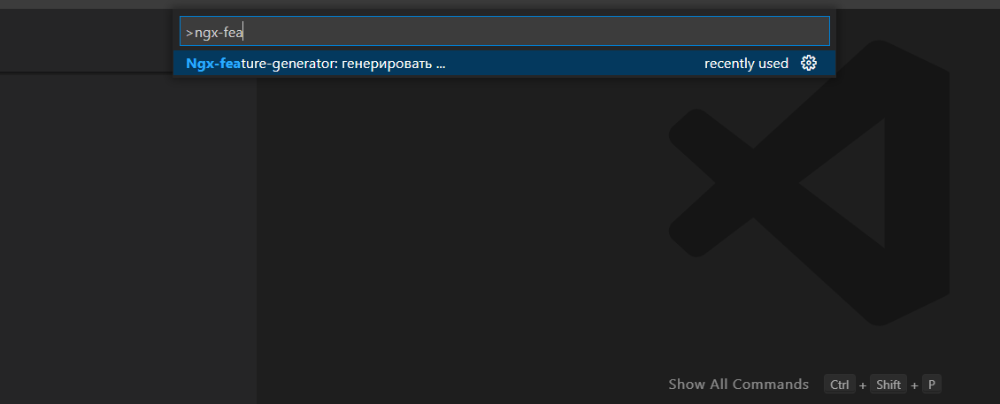
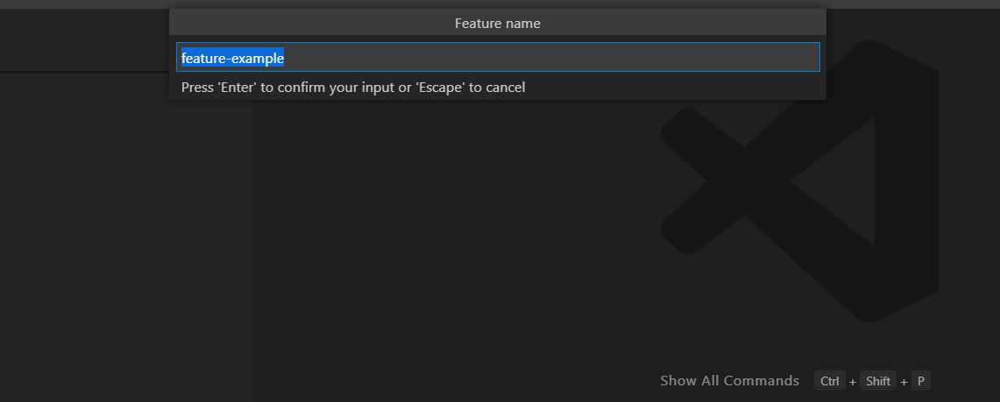
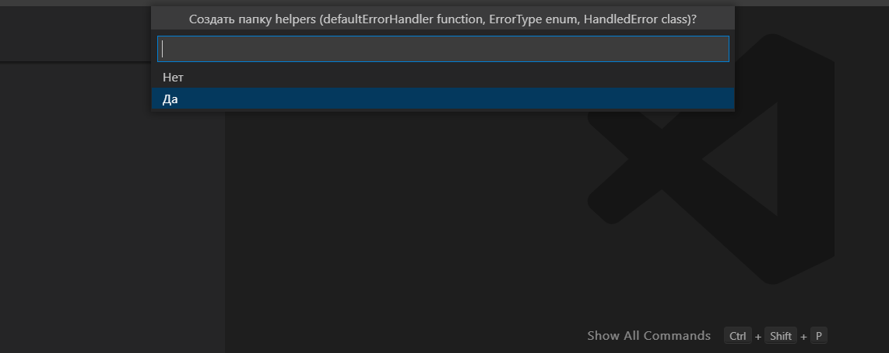
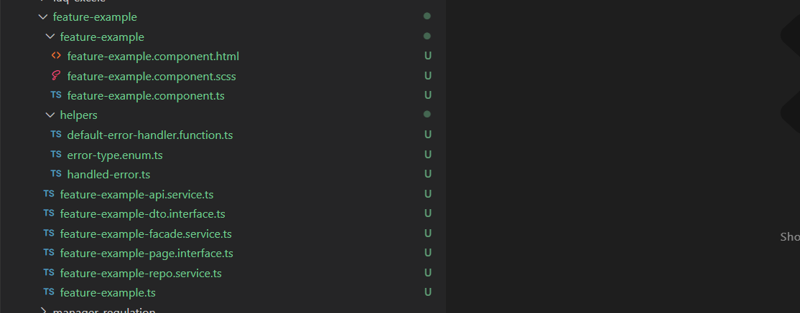
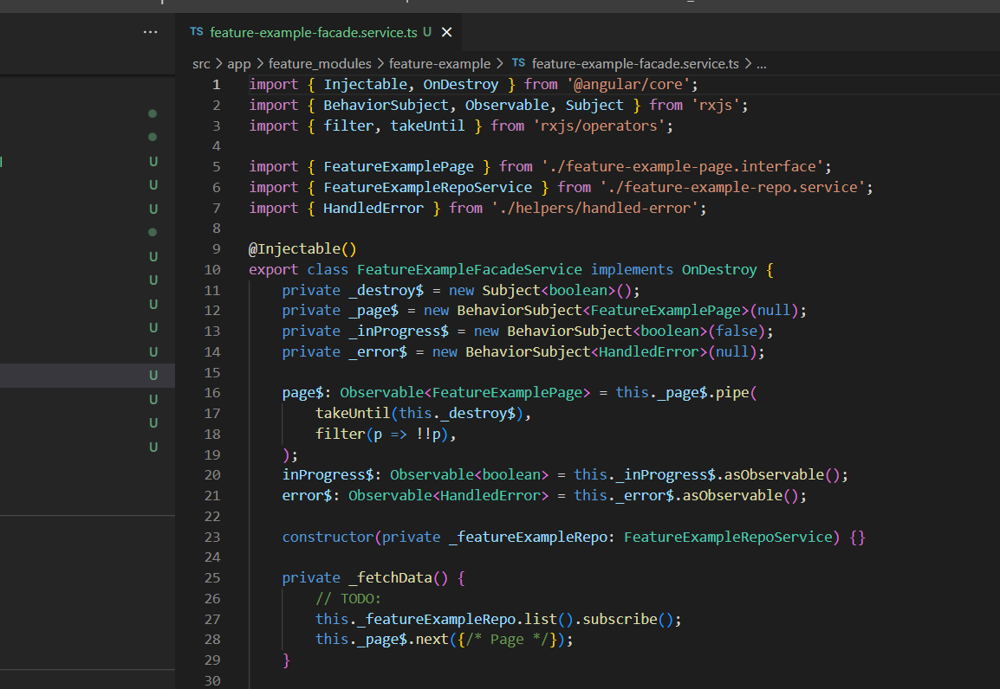

# ngx-feature-generator README

Angular feature generator generate component, API service, Repo service, Facade service, DTO interface, Domain model class, Page model and optionally helper folder (custom error class, deafult function for error handling, custom error type enum)"

## Features

1. Press `F1` or `Ctrl+Shift+P` and start to input *Ngx-feature-generator: generate ...*

2. Press `Enter` and input feature name

3. Press `Enter` and make a choice about a helper folder

4. Ta-da

> Tip: you can configurate a folder for features.

## Extension Settings

* `featureGenerator.featuresParentFolder`: Folder relative to the project root where files will be generated.

## Release Notes

### 1.0.0

Initial release of `Ngx-feature-generator`

**Enjoy!**
